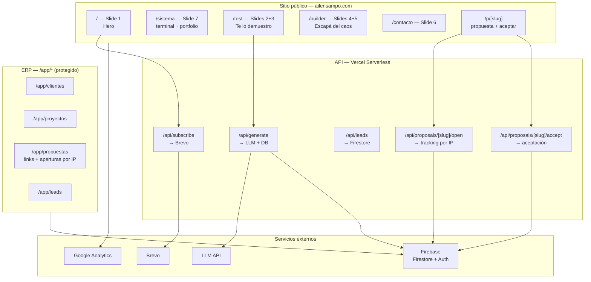

# Ailen Sampó — Stack y plan de migración

> Documento de referencia para la evolución del proyecto.
> **No se hace push a producción hasta que el sitio esté listo.**

---

## Estado actual

| Capa | Tecnología |
|---|---|
| Framework | **Next.js 15** (App Router) + TypeScript |
| Rama activa | `feat/sitio` (desarrollo — `main` intacta) |
| Landing legacy | `legacy/index.legacy.html` (referencia visual Fase 2) |
| Estilos | CSS Modules + variables globales en `src/styles/` |
| Fuentes | Egyptian Slate + Nunito Sans (`public/fonts/`) |
| Assets del sitio | `public/assets/` |
| API | `api/subscribe.js` (Vercel serverless, hasta Fase 4) |
| Datos | `src/data/` (projects, chat, colors) |
| Hosting | Vercel |
| Analytics | Google Analytics (`G-RXWX4CDK0C`) |
| Dev local | `npm run dev` |

### Assets del sitio (lo que se despliega)

```
public/
├── assets/
│   ├── logos/              → logo-horizontal.svg
│   ├── recursos-graficos/  → íconos, caras, dino, mail, OG images
│   └── portfolio/          → proyectos y burbujas
├── fonts/                  → .woff2 solamente
└── favicon.svg
```

### Carpetas fuera del deploy

| Carpeta | Uso | Git |
|---|---|---|
| `notas_privadas/` | Mockups, zips, notas internas | `.gitignore` |
| `_design/` | Fuentes de diseño (logotipos, exports originales) | Commiteado, `.vercelignore` |
| `legacy/` | Landing HTML original de referencia | Commiteado, `.vercelignore` |
| `docs/` | Documentación del proyecto | Commiteado, `.vercelignore` |

---

## Stack objetivo

| Capa | Tecnología | Por qué |
|---|---|---|
| Framework | **Next.js** (App Router) | Routing, SSR/SEO, API routes, mismo deploy en Vercel |
| Lenguaje | **TypeScript** | Tipado para clientes, proyectos, arquitecturas generadas |
| Estilos | **CSS Modules** + variables globales | Migrar el CSS actual sin reescribir todo de golpe |
| Base de datos | **Firebase Firestore** | Clientes, leads, arquitecturas generadas, proyectos |
| SDK | **Firebase Admin SDK** (server) + **Firebase JS SDK** (client) | Sin ORM, documentos tipados con TypeScript |
| Auth (ERP) | **Firebase Auth** | Login solo para el panel interno, setup rápido |
| Email / leads | **Brevo** (mantener) | Suscripciones y contactos |
| IA (generador) | **API de LLM** (a definir) | "Generar Sistema" del mockup |
| Analytics | **Google Analytics** (mantener) | `G-RXWX4CDK0C` |
| Hosting | **Vercel** (mantener) | Sin cambio de infra |

### Lo que NO cambia

- Dominio: `ailensampo.com`
- Cuenta Vercel
- Integración Brevo (`BREVO_API_KEY`, `BREVO_LIST_ID`)
- Assets y fuentes de marca
- `notas_privadas/` en `.gitignore`

### Por qué Firebase (y no Supabase)

| Criterio | Firebase | Supabase |
|---|---|---|
| Curva de aprendizaje | Más baja — SDK directo, sin SQL | Requiere SQL + schema + migraciones |
| Auth para el ERP | Firebase Auth, plug-and-play | Necesita configuración extra |
| Setup inicial | Consola web, 10 minutos | Postgres + tablas + RLS |
| Tiempo real en el panel | Nativo en Firestore | Necesita configurar realtime |
| Free tier | Generoso para empezar | Generoso también |
| Relaciones complejas | Manual (referencias por ID) | SQL nativo con JOINs |
| Escala futura | Muy buena | Muy buena |

**Para este proyecto:** sos una sola persona, el ERP arranca chico (clientes, proyectos, leads), y querés avanzar rápido sin pelearte con SQL. Firebase es más simple y menos arriesgado.

**Cuándo reconsiderar Supabase:** si el ERP crece a facturación, reportes complejos, o múltiples usuarios con permisos granulares. Eso es problema de Fase 5+, no de ahora.

**División de responsabilidades:**
- **Brevo** → emails de marketing y suscripciones (ya funciona)
- **Firebase** → datos de la app (leads, clientes, proyectos, arquitecturas)
- **Vercel** → hosting y API routes

---

## Arquitectura



---

## Estructura de carpetas

```
ailensampo.com/
│
├── public/                      ← estáticos del sitio (se despliegan)
│   ├── assets/
│   │   ├── logos/
│   │   ├── recursos-graficos/
│   │   └── portfolio/
│   ├── fonts/                   ← solo .woff2
│   └── favicon.svg
│
├── src/                         ← código de la aplicación
│   ├── app/                     ← páginas (App Router)
│   │   ├── (site)/              ← sitio público con nav
│   │   ├── p/[slug]/            ← propuesta pública + aceptar
│   │   └── app/                 ← ERP interno (/app/propuestas, …)
│   ├── components/
│   ├── data/
│   ├── lib/
│   │   └── proposals/           ← repo, slug, content loader
│   └── styles/
│
├── content/                     ← fuentes de propuestas (ERP)
│   └── propuestas/
│       └── [slug]/
│           ├── meta.json        ← cliente, precio, estado, slug
│           └── propuesta.html   ← documento que ve el cliente
│
├── api/
│   └── subscribe.js             ← serverless Brevo (hasta Fase 4)
│
├── docs/
│   ├── stack.md                 ← este archivo
│   └── colores.txt              ← paleta de marca
│
├── legacy/
│   └── index.legacy.html        ← landing original (referencia Fase 2)
│
├── _design/                     ← fuentes de diseño (no se despliega)
│   ├── logotipo/
│   ├── logo-secundario/
│   ├── recursos-originales/
│   └── tramas/                  ← texturas y degradés por slide
│       ├── slide-01/ … slide-07/
│
├── notas_privadas/              ← privado (.gitignore)
│
├── package.json
├── next.config.ts
└── tsconfig.json
```

---

## Mapa mockup → páginas

| Slide | Contenido | Ruta | Orden de build |
|---|---|---|---|
| — | Layout global (nav, footer, ventanas) | todas | **Primero** |
| 1 | Hero "Si vos frenás…" | `/` | 1º |
| 2 | "Te lo demuestro" + input de tarea | `/test` | 2º |
| 3 | Arquitectura generada BOT/FLOW/CRM | `/test` (estado resultado) | 2º (misma página) |
| 4 | Mini-juego "Escapá del caos" (inicio) | `/builder` | 3º |
| 5 | Mini-juego (resultado + modo sistema) | `/builder` (post-game) | 3º (misma página) |
| 6 | CTA "Próximo paso" | `/contacto` | 4º |
| 7 | Terminal, chat, email, globitos | `/sistema` | 5º — reutiliza lógica de `legacy/` |
| 8 | Diagrama sistema externo / interno | Concepto ERP | Fase 4 |

> **Nota:** La landing de hoy (`legacy/index.legacy.html`) ≈ slide 7. No se recrea aparte: cuando lleguemos al slide 7, portamos su lógica (globitos, terminal, formulario) al diseño nuevo del mockup. Eso reemplaza lo que está en producción.

---

## Variables de entorno

```env
# Existentes (Vercel)
BREVO_API_KEY=
BREVO_LIST_ID=

# Nuevas (Fase 3+) — Firebase
NEXT_PUBLIC_FIREBASE_API_KEY=
NEXT_PUBLIC_FIREBASE_AUTH_DOMAIN=
NEXT_PUBLIC_FIREBASE_PROJECT_ID=
NEXT_PUBLIC_FIREBASE_STORAGE_BUCKET=
NEXT_PUBLIC_FIREBASE_MESSAGING_SENDER_ID=
NEXT_PUBLIC_FIREBASE_APP_ID=
FIREBASE_SERVICE_ACCOUNT_KEY=   # JSON del service account (solo server, nunca en client)

# Propuestas — hash de IPs (server only)
IP_HASH_SALT=

# Nuevas (Fase 3)
LLM_API_KEY=               # OpenAI, Anthropic, etc.
```

---

## Fases

### Fase 0 — Preparación
**Objetivo:** Documentar y dejar el terreno listo sin romper nada.

- [x] Organizar assets en subcarpetas
- [x] Corregir rutas en landing legacy
- [x] Agregar `notas_privadas/` a `.gitignore`
- [x] Crear `docs/stack.md`
- [x] Reorganizar carpetas (`_design/`, `docs/`, `legacy/`, `public/`)
- [x] Mover `index.html` → `legacy/index.legacy.html`

**Criterio de éxito:** La landing actual sigue funcionando en local. Documentación completa.

---

### Fase 1 — Base Next.js
**Objetivo:** Inicializar Next.js en el mismo repo, conviviendo con la landing legacy.

**Tareas:**
- [x] Inicializar Next.js manualmente (TypeScript, App Router, sin Tailwind)
- [x] Configurar `next.config.ts`
- [x] Mover `assets/` y `fonts/` a `public/`
- [x] Crear `src/styles/globals.css` con variables CSS y `@font-face`
- [x] Crear `src/data/projects.ts`, `chat.ts`, `colors.ts`
- [x] Layout base con meta tags, OG, favicon, Google Analytics
- [x] Scripts en `package.json`: `dev`, `build`, `start`
- [x] Rama `feat/sitio` creada
- [x] Verificar `npm run dev` y `npm run build`

**Criterio de éxito:**
- `npm run dev` levanta Next.js en `localhost:3000`
- Fuentes y assets cargan correctamente
- `legacy/index.legacy.html` accesible como referencia
- `api/subscribe.js` sigue respondiendo

**Estimación:** 1–2 días

---

### Fase 2 — Sitio slide por slide
**Objetivo:** Construir el sitio completo del mockup, en orden. La landing actual no se recrea aparte: su contenido (slide 7) se integra cuando corresponda.

**Enfoque:**
- Cada slide = una página o estado de página en React
- `legacy/index.legacy.html` = referencia de **lógica** (globitos, terminal, formulario), no de diseño final
- El layout global (nav, footer) se hace primero y envuelve todo

---

#### 2.0 — Layout global (antes del slide 1)
- [x] `Nav.tsx` — SISTEMA · TEST · BUILDER · CONTACTO + logo + menú mobile fullscreen
- [x] `StatusBadge.tsx` — "Disponible para nuevos proyectos" (nav desktop · hero mobile)
- [x] `Ticker.tsx` — barra naranja (slide 1)
- [x] `WindowFrame.tsx` — ventanas estilo terminal del mockup
- [x] `GridOverlay.tsx` — grilla CSS
- [x] `src/styles/animations.css` — keyframes globales (pulse online, buzz MSN)
- [x] Estilos compartidos: gradientes, grid, tipografía

**Criterio:** Nav visible en todas las rutas. Status en nav (desktop) o hero (mobile ≤640px).

---

#### 2.1 — Slide 1 → `/` (pausado — base usable)
- [x] Hero con gradiente rosa/violeta + grid
- [x] Ventanas superpuestas con copy del mockup (proporciones desktop replicadas en mobile)
- [x] Íconos decorativos amarillos (triángulo `!` + `(!!)`)
- [x] Footer ticker naranja (1 línea desktop · 2 líneas mobile)
- [x] Responsive mobile: hero compacto, nav MENÚ/CERRAR, status centrado en violeta
- [~] Animaciones Paso B (parcial): pulso verde online + buzz ventanas tipo MSN
- [ ] Ajustes finos slide 1 (posición ventanas/íconos en mobile)
- [ ] Validación final vs `slides/1.png` (ver `docs/revisiones/slide-01.md`)

**Workflow acordado por slide:** estático desktop → estático mobile → validar → animaciones → siguiente.

---

#### 2.2 — Slides 2 + 3 → `/test`
- [ ] Slide 2: "Te lo demuestro" + input de tarea + tags de pain points
- [ ] Botón "Generar Sistema"
- [ ] Slide 3: vista resultado con tarjetas BOT → FLOW → CRM
- [ ] CTAs: "Quiero este sistema", "Descargar arquitectura", "Probar otra tarea"
- [ ] Transición entre estado input y estado resultado (React state)

**Referencia:** `slides/2.png`, `slides/3.png`

---

#### 2.3 — Slides 4 + 5 → `/builder`
- [ ] Slide 4: mini-juego "Escapá del caos" (30 seg, contadores)
- [ ] Slide 5: pantalla post-juego "Modo Sistema" + flujo BOT → CLASIFICA → RESPONDE
- [ ] CTAs: "Ver mi sistema", "Jugar de nuevo"

**Referencia:** `slides/4.png`, `slides/5.png`

---

#### 2.4 — Slide 6 → `/contacto`
- [ ] CTA "Próximo paso" con ventanas superpuestas
- [ ] Formulario de contacto
- [ ] Conexión a Brevo (`/api/subscribe`)

**Referencia:** `slides/6.png`

---

#### 2.5 — Slide 7 → `/sistema`
Reemplaza/adapta la landing actual. Portar desde `legacy/index.legacy.html`:

| Componente | Qué hace | Referencia legacy |
|---|---|---|
| `Globitos.tsx` | Portfolio flotante (física) | Líneas ~881–1263 |
| `Terminal.tsx` | Chat + barras de progreso | Líneas ~1314–1390 |
| `EmailForm.tsx` | Suscripción → Brevo | Líneas ~1419–1465 |
| `Typewriter.tsx` | Headline animado | Líneas ~1279–1313 |
| `Cursor.tsx` | Cursor personalizado | Líneas ~853–879 |
| `DinoSuccess.tsx` | Pantalla de éxito | Líneas ~1392–1417 |

- [ ] Diseño según mockup slide 7 (no copia pixel-perfect del legacy)
- [ ] Datos desde `src/data/projects.ts` y `src/data/chat.ts`

**Referencia:** `slides/7.png` + `legacy/index.legacy.html`

---

**Criterio de éxito Fase 2:**
- Las 5 rutas públicas funcionan y son navegables entre sí
- Diseño fiel al mockup
- Slide 7 captura emails en Brevo
- Responsive en mobile

**Estimación:** 2–3 semanas

---

### Fase 3 — Backend y datos
**Objetivo:** Persistir leads, arquitecturas generadas y preparar terreno para el ERP.

**Tareas:**
- [ ] Crear proyecto en Firebase Console
- [ ] Activar Firestore + Firebase Auth
- [ ] Colecciones iniciales en Firestore:
  ```
  leads/{id}                    → email, source, createdAt
  architectures/{id}            → taskInput, bot, flow, crm, leadId, createdAt
  clients/{id}                  → name, email, company, status, createdAt
  projects/{id}                 → clientId, title, url, status, createdAt
  proposals/{id}                → clientId, projectId, slug, title, sections, price, timeline, status, acceptedAt
  proposals/{id}/opens/{openId} → ipHash, openedAt, referrer, userAgent, utm_*
  ```
- [ ] Conectar `/api/proposals/[slug]/open` y `/accept` a Firestore (hoy: mock en memoria)
- [ ] Configurar reglas de seguridad (Firestore Rules + Auth)
- [ ] Migrar `api/subscribe.js` → `src/app/api/subscribe/route.ts`
- [ ] Crear `/api/generate` (recibe tarea → LLM → devuelve arquitectura → guarda en Firestore)
- [ ] Guardar leads del generador y del formulario de contacto

**Criterio de éxito:**
- "Generar Sistema" produce arquitectura real vía IA
- Leads y arquitecturas quedan guardadas en Firestore
- Emails siguen llegando a Brevo

**Estimación:** 3–5 días

---

### Fase 4 — ERP
**Objetivo:** Panel interno para gestionar clientes, proyectos y leads.

**Rutas protegidas (`/app/*`):**

| Módulo | Funcionalidad |
|---|---|
| `/app/clientes` | CRUD de clientes |
| `/app/proyectos` | Proyectos vinculados a clientes |
| `/app/propuestas` | Crear propuestas, copiar link, ver aperturas **por IP** |
| `/app/leads` | Leads del sitio + arquitecturas generadas |

**Propuestas (Opción B — integrado):**

| Pieza | Ruta | Qué hace |
|---|---|---|
| Vista cliente | `/p/[slug]` | Muestra propuesta + botón **Aceptar** |
| Tracking | `POST /api/proposals/[slug]/open` | Registra cada apertura con IP hasheada |
| Aceptación | `POST /api/proposals/[slug]/accept` | Marca propuesta y proyecto como aceptados |
| Panel | `/app/propuestas` | Lista, contador total y desglose por IP |

Link trackeado para enviar al cliente:
```
https://ailensampo.com/p/abc123?utm_source=whatsapp
```

**Tareas:**
- [ ] Auth (login con Firebase Auth — solo tu usuario al inicio)
- [ ] Layout del ERP (sidebar, header)
- [ ] CRUD clientes
- [ ] CRUD proyectos (vinculados a clientes)
- [ ] CRUD propuestas + generación de slug único
- [ ] Vista de aperturas agrupadas por IP en detalle de propuesta
- [ ] Vista de leads con arquitecturas generadas
- [ ] Dashboard básico (leads nuevos, propuestas vistas, clientes activos)

**Criterio de éxito:**
- Solo usuarios autenticados acceden a `/app/*`
- Podés crear, editar y listar clientes, proyectos y propuestas
- Cada propuesta tiene link único con tracking de aperturas por IP
- Leads del sitio aparecen en el panel

**Estimación:** 2–4 semanas

---

### Fase 5 — Deploy
**Objetivo:** Publicar el sitio completo en producción.

**Tareas:**
- [ ] `npm run build` sin errores
- [ ] Configurar variables de entorno en Vercel
- [ ] Testear todas las rutas en preview deploy
- [ ] Verificar OG images, meta tags, GA
- [ ] Verificar `/api/subscribe` en producción
- [ ] Eliminar `legacy/` cuando slide 7 esté validado
- [ ] **Push a producción**

**Criterio de éxito:**
- `ailensampo.com` sirve el sitio Next.js completo
- Formularios funcionan
- ERP accesible en `ailensampo.com/app`
- Sin regresiones respecto a la landing anterior

**Estimación:** 1 día

---

## Resumen de tiempos

| Fase | Qué | Estimación |
|---|---|---|
| 0 | Preparación | ✅ Hecho |
| 1 | Base Next.js | ✅ Hecho |
| 2 | Sitio slide por slide (layout + slides 1–7) | 2–3 semanas |
| 3 | Backend + Firebase | 3–5 días |
| 4 | ERP | 2–4 semanas |
| 5 | Deploy | 1 día |
| **Total** | | **~4–7 semanas** |

---

## Reglas durante el desarrollo

1. **No push hasta Fase 5.** Todo se desarrolla y testea en local + preview deploys de Vercel.
2. **`legacy/index.legacy.html` es referencia de lógica** para el slide 7, no un objetivo de diseño.
3. **Un slide a la vez**, en orden: layout → 1 → 2+3 → 4+5 → 6 → 7. Por slide: **desktop + mobile juntos** antes de pasar al siguiente.
4. **Los assets viven en `public/assets/`.** No duplicar.
5. **`notas_privadas/` nunca se commitea.** Mockups y notas internas solamente.
6. **Cada componente nuevo tiene su carpeta en `src/components/`.** No crecer archivos gigantes.
7. **Dev en celular:** `npm run dev` (escucha en `0.0.0.0`). Usar IP Wi‑Fi (`192.168.x.x`), no la IP WSL que muestra Next.

---

## Próximo paso

**Slide 1 pausado** — base desktop + mobile usable. Al retomar: ajustes finos o validación final, luego **Fase 2.2 — Slides 2+3 → `/test`**.

```bash
git checkout feat/sitio
npm run dev
# Celular (misma Wi‑Fi): http://<tu-ip-wifi>:<puerto>
```

Mockups: `notas_privadas/_mockupSitio/slides/` · Feedback slide 1: `docs/revisiones/slide-01.md`
